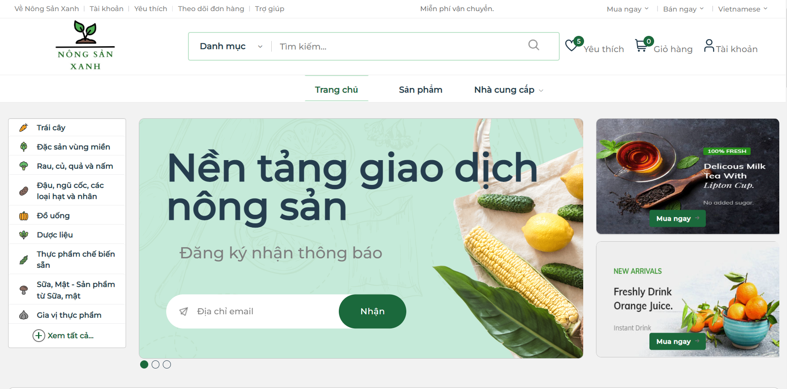

# Nong San Xanh - C2C eCommerce Platform 

I developed an online marketplace by HTML, CSS, Javascript, PHP, and MySql that enables Users to Buy and Sell agricultural products. Nong San Xanh is an e-commerce platform for the Agricultural industry. 

This is my first time coding front-end & back-end, in a Web Application class at my school (UIT-University of Information Technology).
I'm aware that the code is a little messy because I didn't use a framework or model; instead, I concentrated on how to code it quickly for the end-of-class project on my own. Of course, I have some help to fix bugs from the anonymous one. I finished it on time, got a fantastic mark, and more importantly, I achieved my goal of creating a platform that would make it simple for people in my country to connect with one another and exchange agricultural goods through e-Commerce. I've always wanted to create a platform just for small and medium-sized enterprises in Vietnam. This is the first step toward my dream.

I designed (Balsamiq) & developed both front-end and back-end with almost full functional expected for my website which is an online marketplace that enables Users to Buy and Sell products. The platform was created particularly for web users, therefore I integrated the templates to create a beautiful user interface for customers and clean, simple pages for sellers to manage their products. I also used PHP and MySQL to create the back-end for it. 

## Design
[Balsamiq](https://drive.google.com/file/d/1S-FKyncp7Nfg4j0LZA1Jb8i_UxONt50P/view)

## Demo

## Video Demo

## Authors

- [@quynhngocnhi](https://github.com/QuynhNgocNhi/)

## Deployment

To deploy this project check out this link:

[How to Run PHP file on localhost](https://www.youtube.com/watch?v=tcoIVp1eNgM&ab_channel=GeekyScript)
